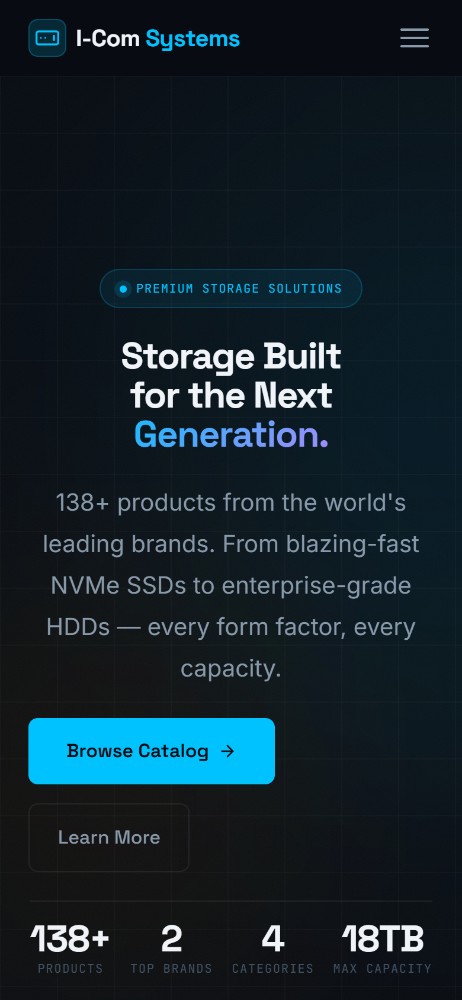
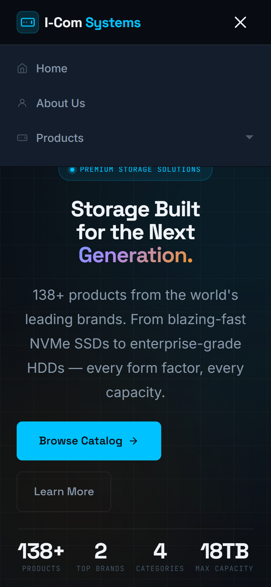
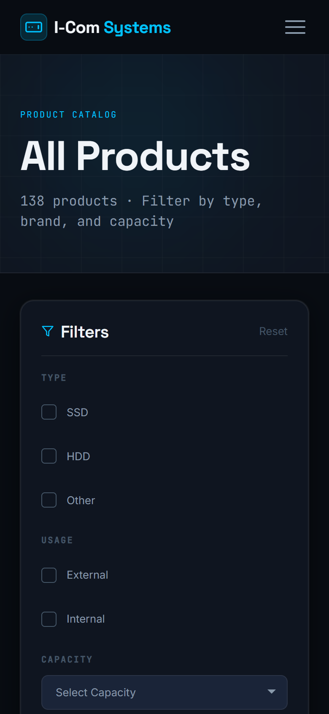
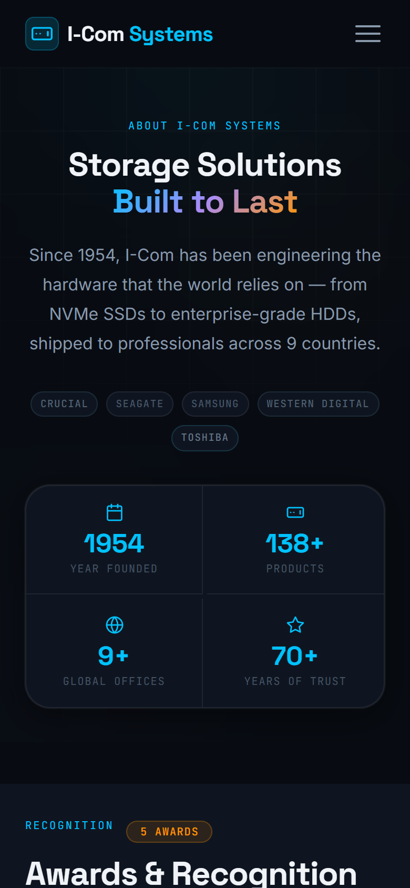
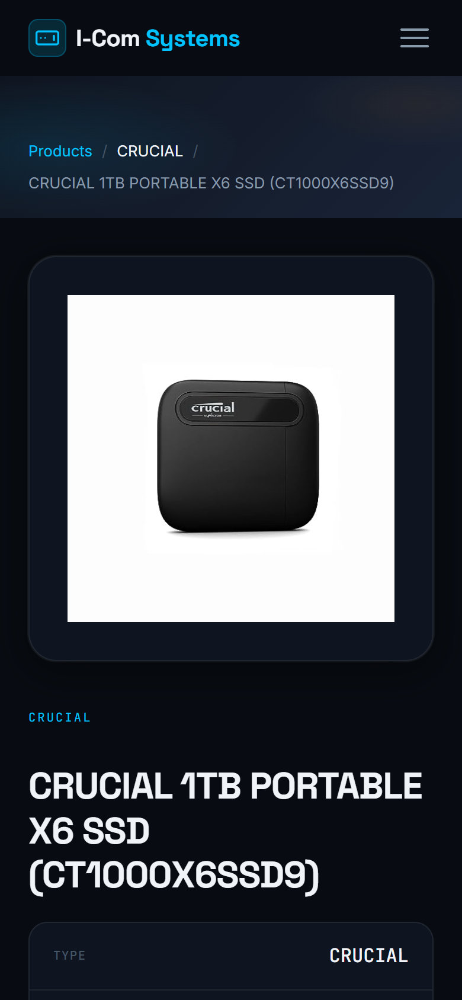

# I-Com Systems

A premium online product catalog for **I-Com Systems** — a global distributor of storage hardware carrying 138+ products across the world's leading brands.

**Live site: [icomsystems.netlify.app](https://icomsystems.netlify.app/)**

---

## What It Does

Customers can browse the full product catalog, filter by brand, type, and capacity, and view detailed specs for any drive — all in one fast, elegant web experience.

### Key Capabilities

- **Browse 138+ products** across SSDs, HDDs, and external drives
- **Filter the catalog** by brand, type (SSD/HDD), usage (internal/external), capacity, and name search
- **Jump directly to a brand** from the navigation dropdown
- **View product details** — specs, image, and category at a glance
- **Learn about the company** — history, milestones, team, and awards

---

## Pages

### Home
The landing page introduces the brand and product range — featuring a hero section with key stats, a live product marquee, category cards with real product counts, and brand-specific product carousels.


### Products Mega-Menu
The navigation includes a hover dropdown to browse by brand or product category directly.


### Product Catalog
A full filterable catalog with a sidebar for narrowing results. Filters include type, usage, brand, capacity, and name search. Each card links to the product detail page.


### Product Detail
A dedicated page per product showing the full image, specs, and breadcrumb navigation.


### About
Company background, founding history, global office locations, a timeline of milestones, team profiles, and an awards carousel.


---

## Mobile View

Fully optimised for phones — the navigation collapses into a clean hamburger menu with an accordion-style Products panel to browse brands and categories.

### Mobile Home


### Mobile Navigation


### Mobile Product Catalog


### Mobile About Page


### Mobile Product Detail


---

## Brands Covered

Crucial · Seagate · Samsung · Western Digital · Toshiba · LaCie · Synology · Fyber

---

## Tech Overview

| | |
|---|---|
| Frontend | React 18, React Router v6, Framer Motion |
| Styling | CSS custom properties design system (no UI framework) |
| Carousels | Splide |
| Backend | Flask (Python) — serves product data from CSV via `/api/products` |
| Fonts | Space Grotesk · Inter · JetBrains Mono |
| Deployment | Netlify (frontend) |

### Running Locally

```bash
npm install && npm start        # React dev server → localhost:3000
cd src/scripts && python app.py # Flask backend  → localhost:5000
```

```bash
npm run build                   # Production build → /build
```

---

## License

Personal/portfolio project. All product names and brand assets belong to their respective owners.
