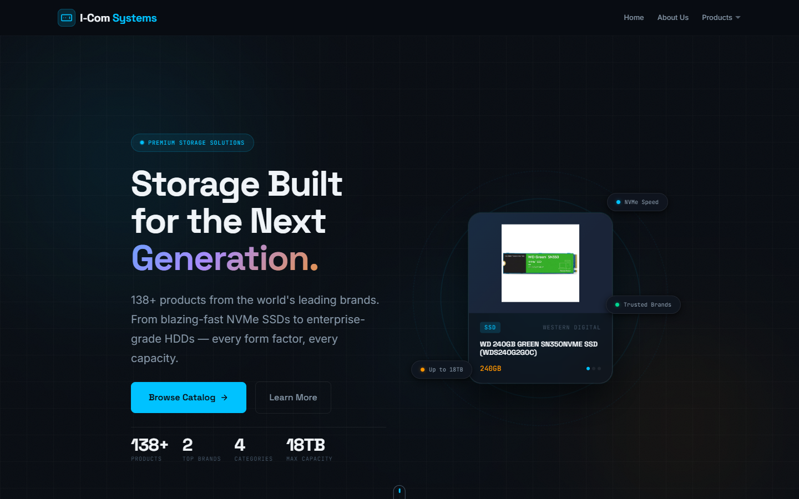
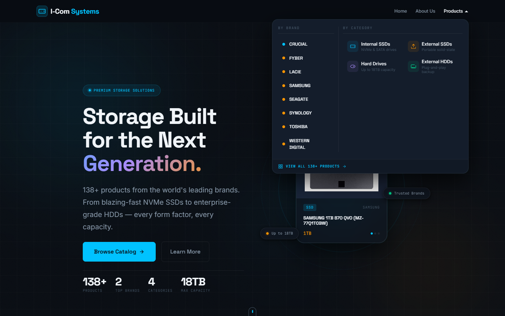
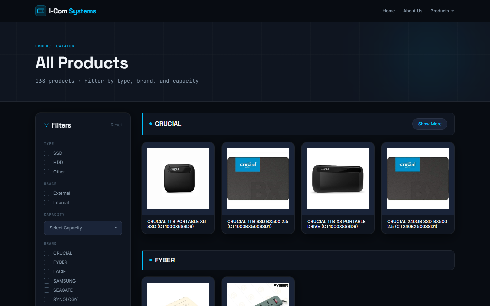
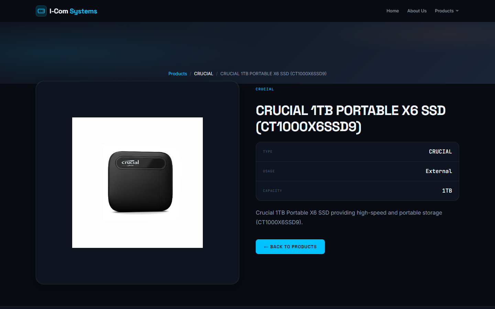
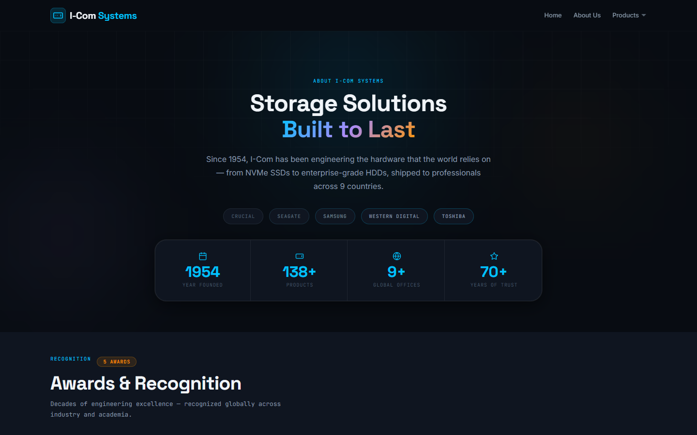

# I-Com Systems

A premium dark-mode product catalog and brochure web app for **I-Com Systems** — a global storage hardware distributor carrying 138+ products across brands including Crucial, Seagate, Samsung, Western Digital, Toshiba, LaCie, Synology, and more.

Live deployment: [**icomsystems.netlify.app**](https://icomsystems.netlify.app/)

---

## Screenshots

### Landing Page — Hero


### Products Mega-Menu Navigation


### Product Catalog


### Product Detail Page


### About Page


---

## What the App Does

I-Com Systems is a single-page React application that serves as a **product catalog and company brochure** for a storage hardware distributor. It fetches live product data from a Flask backend, renders a filterable catalog of 138+ drives, and provides individual product detail pages — all wrapped in a premium SAAS-level dark UI.

### Core Features

| Feature | Description |
|---|---|
| **Live product data** | Fetched from a Flask/Python backend (`/api/products`), cached client-side |
| **Filterable catalog** | Filter by Type (SSD/HDD/Other), Usage (Internal/External), Capacity, Brand, and free-text search |
| **Product detail pages** | Per-product page with specs, image, breadcrumb navigation, routed via React Router |
| **Brand mega-menu** | Fixed glass nav with a 2-column dropdown — browse by brand or category |
| **About page** | Company history, stats, awards carousel, and team profiles |
| **Fully responsive** | Mobile hamburger nav, responsive grid (4 → 3 → 2 → 1 columns) |

---

## Pages

### `/` — Home
The landing page is designed at SAAS marketing level:

- **Hero section** — Full-viewport split layout with animated gradient blobs, floating product card, 3 rotating rings, NVMe/capacity/brand floating chips, and a scroll indicator. Stats strip (138+ products, 2 brands, 4 categories, 18TB max).
- **Product marquee** — Dual-row infinite CSS auto-scroll of product images, pauses on hover.
- **Features strip** — 4-column highlights: Blazing SSDs, Enterprise Reliability, Top-Tier Brands, Every Form Factor.
- **Category grid** — 4 live category cards (Internal SSD, External SSD, HDD, External HDD) with real product counts and sample images pulled from the catalog.
- **Product carousels** — Splide-powered sliders for each brand, showing cards with Quick View modal support.
- **CTA banner** — Animated closing call-to-action section.

### `/product-page` — Product Catalog
Full product catalog with a sidebar + main content layout:

- **Catalog hero** — Page banner with animated blob background and live product count.
- **Sticky sidebar filter** — Custom-styled checkboxes (Type, Usage, Brand), capacity dropdown, and name search. Apply / Reset controls.
- **Active filter pills** — Shows currently active filters as dismissible tags above the grid.
- **Product grid** — 4-column responsive card grid per brand section. Cards feature hover lift, shine sweep, and "View Details" overlay. "Show More" per brand to expand beyond the first row.
- **Hash routing** — Nav mega-menu links (e.g. `#hdr-CRUCIAL`) scroll directly to a brand section.

### `/product/:brand/id/:id` — Product Detail
Individual product page:

- Gradient mesh hero banner with brand label.
- Split layout: image frame card (left) + spec table (right) with staggered Framer Motion reveal.
- Specs: Type, Usage, Capacity.
- Breadcrumb navigation: Products → Brand → Product name.
- Back to Products button.

### `/about-page` — About
Company brochure page:

- **Hero** — Centered full-width section with animated blobs, gradient headline, brand badge row with pulse animation, and 4-stat glassmorphism card (Founded, Products, Offices, Years of Trust).
- **Awards & Recognition** — Full-width Splide fade carousel of award images with a proper section header.
- **Company story** — 3-column glassmorphism card: narrative text + location chips + 4 highlight tiles (Headquarters, Industries, Founder, Catalog).
- **Timeline** — 2-column grid of milestone cards (1954 → 1980s → 2000s → Today) with glowing dot markers and `whileInView` stagger animations.
- **Team** — Profile cards with photo, role, tag badge, bio, and mini metrics.

### `/about-page` — 404
Custom not-found page with a back-to-home button.

---

## Tech Stack

| Layer | Technology |
|---|---|
| Frontend framework | React 18 (Create React App) |
| Routing | React Router v6 |
| Animations | Framer Motion |
| Carousels | `@splidejs/react-splide` |
| Backend | Flask (Python) — serves CSV product data via `/api/products` |
| Styling | Pure CSS with a full CSS custom property design system |
| Fonts | Inter (body) · Space Grotesk (headings) · JetBrains Mono (specs/labels) |
| Deployment | Netlify (frontend) |

---

## Design System

All design tokens live in `src/index.css` as CSS custom properties:

```
Palette:   --color-bg-base #080c12  ·  --color-accent-primary #00c2ff  ·  --color-accent-secondary #ff9500
Spacing:   8pt grid — --space-1 (4px) through --space-32 (128px)
Type:      1.25 Major Third scale — --text-xs through --text-4xl
Shadows:   --shadow-sm/md/lg/xl  ·  --glow-primary  ·  --glow-card
Radii:     --radius-sm (4px) through --radius-full
Transitions: --transition-fast (150ms) through --transition-spring (500ms spring)
```

Key visual treatments:
- **Glassmorphism** — `backdrop-filter: blur()` + `rgba` fills on nav, cards, modals, and dropdowns
- **Animated blobs** — Radial gradient `div`s with `filter: blur()` drifting via CSS keyframes
- **Framer Motion** — `whileInView` stagger reveals, `AnimatePresence` for dropdown/modal enter/exit, spring transitions on cards
- **CSS marquee** — Pure CSS infinite scroll (`translateX(-50%)`) with duplicated item arrays, pauses on hover

---

## Project Structure

```
src/
├── components/
│   ├── HomePage/
│   │   ├── HeroSection.jsx / .css      # Full-viewport hero
│   │   ├── ProductMarquee.jsx / .css   # Infinite CSS scroll strip
│   │   ├── FeaturesStrip.jsx / .css    # 4-column feature highlights
│   │   ├── CategoryGrid.jsx / .css     # Live category cards
│   │   ├── SpliderSet.jsx              # Brand carousel orchestrator
│   │   ├── MySplider.jsx / .css        # Splide carousel wrapper
│   │   ├── ProductCard.jsx / .css      # Card + Quick View modal
│   │   ├── CTABanner.jsx / .css        # Closing CTA
│   │   ├── MyHeader.jsx / .css         # Fixed glass nav + mega-menu
│   │   ├── MyFooter.jsx                # Dark footer
│   │   └── Home.jsx                   # Home page orchestrator
│   ├── ProductPage/
│   │   ├── ProductsHome.jsx / .css     # Catalog layout + hero
│   │   ├── Filter.jsx / .css           # Sidebar filter panel
│   │   ├── FilterParams.jsx / .css     # Active filter pills
│   │   └── AvailableProducts.jsx       # Filtered grid renderer
│   ├── AboutPage/
│   │   ├── AboutPage.jsx               # Page orchestrator + hero + timeline
│   │   ├── Awards.jsx                  # Awards carousel section
│   │   ├── CompanyInfo.jsx             # Glassmorphism story card
│   │   └── PersonalInfo.jsx            # Team profile cards
│   └── Layout/
│       └── Layout.jsx / .css           # Route wrapper with page transitions
├── scripts/
│   ├── FetchData.js                    # API fetch + client-side cache
│   ├── HelperFunctions.js              # processData(), imagesContext
│   ├── CreateCards.js                  # JSX card + section header factory
│   ├── FilterUtilities.js              # Filter logic, checkbox renderers
│   └── SearchFunction.js              # Name search utility
├── assets/                            # Award images (image1–5.jpg)
└── index.css                          # Full design system (tokens + reset + utils)

screenshots/                           # App screenshots for documentation
public/
└── index.html                         # Google Fonts preconnect
```

---

## Getting Started

### Prerequisites

- Node.js 16+
- Python 3 + Flask (for the backend data server)

### Install & Run

```bash
# Install frontend dependencies
npm install

# Start the Flask backend (in a separate terminal)
cd src/scripts
python app.py        # runs on http://localhost:5000

# Start the React dev server
npm start            # runs on http://localhost:3000
```

### Build for Production

```bash
npm run build
```

The optimised output is placed in `build/`. Deploy to any static host (Netlify, Vercel, etc.) — ensure your host proxies `/api/*` to the Flask backend.

---

## Data Flow

```
Flask backend (app.py)
  └── reads product CSVs
  └── exposes GET /api/products  →  { brand: { Name, Capacity, Usage, Type, ... } }

FetchData.js
  └── fetches on app load, caches in sessionStorage
  └── passes raw data down as props

HelperFunctions.js → processData()
  └── flattens data, attaches images via require.context
  └── returns [productArray, brandNames]

Components consume props — no Redux, no external state library
```

---

## Brand Coverage

| Brand | Types |
|---|---|
| Crucial | Internal SSDs, External SSDs, Portable Drives |
| Seagate | HDDs, External HDDs, Portable Drives |
| Samsung | Internal SSDs |
| Western Digital | HDDs, External HDDs, SSDs |
| Toshiba | HDDs, External HDDs |
| LaCie | External HDDs, Portable Drives |
| Synology | NAS Drives |
| Fyber | SSDs |

---

## License

This project is a personal/portfolio project. All product names and brand assets belong to their respective owners.
